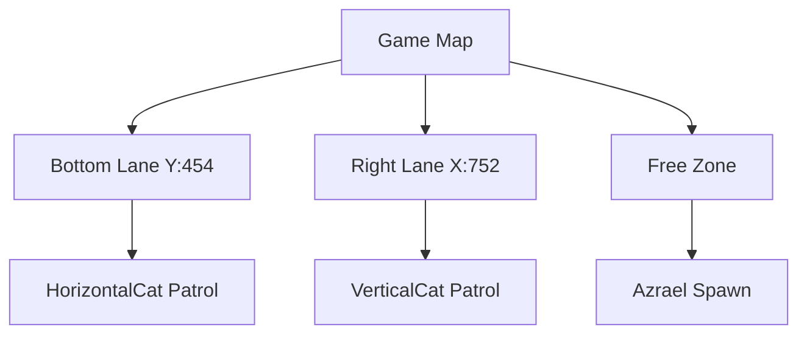

# 📸 Game Images Reference Guide

This document explains the image files referenced in the README and where to place them.

## Image Directory Structure

```
docs/
└── images/
    ├── gameplay_overview.png         # Main gameplay view showing UI and environment
    ├── azrael_threat.png             # Screenshot of Azrael (stationary cat)
    ├── horizontal_cat_lane.png       # Screenshot of bottom lane with HorizontalCat
    ├── vertical_cat_lane.png         # Screenshot of right side with VerticalCat
    ├── items_powerups.png            # Screenshot showing coins, potions, buffs
    ├── health_ui.png                 # Screenshot of health bar and UI elements
    └── game_loop_timing.png          # Diagram showing timer architecture
```

## Required Screenshots

### 1. **gameplay_overview.png** (Primary Screenshot)
- **Purpose**: Main showcase image at top of README
- **Capture**: Full game window during active gameplay
- **Size**: Recommended 800×600px or 1024×768px
- **Include**:
  - Papa Smurf in center
  - At least one enemy (cat or Azrael)
  - Health bar in top-right
  - Score/time display
  - Coins visible on map
  - Some obstacles (trees)

### 2. **azrael_threat.png**
- **Purpose**: Show Azrael character and threat
- **Capture**: Close-up of Azrael enemy
- **Size**: 400×300px suggested
- **Include**:
  - Azrael sprite clearly visible
  - Name label or identifier

### 3. **horizontal_cat_lane.png**
- **Purpose**: Demonstrate bottom lane patrol system
- **Capture**: Bottom portion of game showing horizontal cat
- **Size**: 800×200px suggested
- **Include**:
  - HorizontalCat moving left/right at Y:454
  - Lane boundary or indicator
  - Obstacles the cat bounces off

### 4. **vertical_cat_lane.png**
- **Purpose**: Show right side lane patrol system
- **Capture**: Right portion of game showing vertical cat
- **Size**: 200×600px suggested
- **Include**:
  - VerticalCat moving up/down at X:752
  - Lane boundary or indicator
  - Some vertical movement evidence

### 5. **items_powerups.png**
- **Purpose**: Showcase collectible items and power-ups
- **Capture**: Game area with various items visible
- **Size**: 600×400px suggested
- **Include**:
  - Blue Potion (health item)
  - Speed Buff (yellow potion)
  - Multiple coins
  - Clear labels or annotations

### 6. **health_ui.png**
- **Purpose**: Display health system and UI elements
- **Capture**: Top-right corner and center of screen
- **Size**: 500×300px suggested
- **Include**:
  - Health bar (85% → 30% → 10% states)
  - HP Display text (e.g., "HP: 85/100")
  - Damage indicator if visible
  - Score/Time display

### 7. **game_loop_timing.png** (Diagram)
- **Purpose**: Visual representation of timer architecture
- **Type**: Diagram or flowchart (NOT a screenshot)
- **Size**: 800×400px suggested
- **Include**:
  - Timer boxes: Animation (150ms), Enemy Movement (200ms), Score (1000ms), Auto-Save (1000ms)
  - Arrows showing connections
  - Labels for each component
  - Color-coded by interval if possible

## How to Capture Screenshots

### Using Windows
1. Play the game and position at desired scene
2. Press **PrtScn** to capture full screen
3. Paste into Paint or image editor
4. Crop to desired area
5. Save as PNG in `docs/images/`

### Using SnagIt or ShareX (Recommended)
1. Use hotkey to capture region
2. Auto-save to docs/images/ folder
3. Rename appropriately
4. Compress with PNGCrush if needed

### Compression
Optimize file sizes:
```bash
# Using PNGCrush (install via Chocolatey)
pngcrush -brute -reduce input.png output.png

# Or use online tools like TinyPNG
```

## Image Format Requirements

- **Format**: PNG (lossless quality)
- **Max Size**: 2MB per image
- **Dimensions**: Suggested sizes above
- **Resolution**: 72-96 DPI
- **Color Mode**: RGB (no palette mode)

## Markdown Image Syntax

All images in README use this format:
```markdown

```

## Testing Images Display

After adding images:
1. View README on GitHub to verify display
2. Check on mobile view as well
3. Ensure alt-text is descriptive
4. Confirm file paths are correct

## Alternative: Using Placeholder Diagrams

If capturing screenshots is not possible, create diagrams using:
- **Draw.io**: Free online diagram tool
- **Diagrams.net**: Browser-based
- **ASCII Art**: For simple diagrams in README
- **Mermaid**: GitHub-supported diagram syntax

### Mermaid Example (Lane System):


## Updating Images

If game changes occur:
1. Take new screenshots
2. Replace old images in `docs/images/`
3. Update README if descriptions change
4. Commit changes with message: `docs: update game screenshots`

## Image Attribution

- All game images are original screenshots
- Original game UI and characters captured during gameplay
- No external images without proper attribution

---

**Last Updated**: December 2024  
**Images Status**: Ready for screenshot capture
